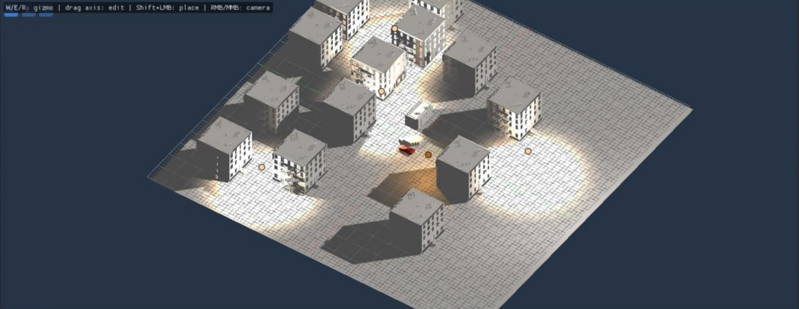
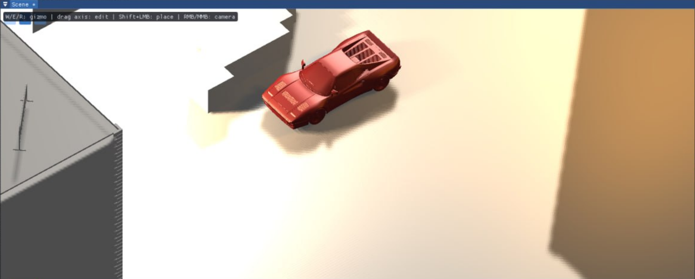

# IrisTech Game Engine

IrisTech is a custom game engine written in C++ and developed from scratch.

The project focuses on real-time rendering, engine architecture, scene management,
graphics programming, and experimentation with modern game development technologies.

> The engine is currently under active development.  
> This repository serves as a public technical showcase of the project.

---

## Features

Currently implemented or actively developed:

- 3D rendering with bgfx
- DirectX 11 rendering backend
- Custom shader pipeline
- Material system
- Directional lighting
- Point lights
- Dynamic shadows
- Shadow mapping
- Entity Component System based on EnTT
- Scene and entity management
- Component-based object architecture
- Frustum culling
- Camera system
- Asset and model loading
- ImGui-based editor tools
- Scene manipulation tools
- CMake-based build system

---

## Tech Stack

- **C++**
- **bgfx**
- **DirectX 11**
- **CMake**
- **EnTT**
- **ImGui**
- **GLM**
- **bgfx shader pipeline**

---

## Screenshots

### Scene Editor

Large test scene demonstrating scene management, multiple 3D objects,
dynamic lighting, real-time shadows, and editor tools.

### Dynamic Lighting & Shadows

Real-time lighting and shadow mapping demonstration inside IrisTech.

---

## Rendering

The rendering system is one of the main areas of development in IrisTech.

Current rendering features include:

- 3D mesh rendering
- Material parameters
- Vertex and fragment shaders
- Directional light
- Multiple point lights
- Per-pixel lighting
- Shadow mapping
- Depth-based shadow rendering
- Camera-based scene rendering
- Frustum culling
- Render targets

The renderer currently uses **bgfx** with the **DirectX 11 backend**.

---

## Lighting & Shadows

IrisTech currently supports several lighting systems.

### Directional Lighting

Directional lighting is used for large-scale light sources such as sunlight.

The engine supports:

- Light direction
- Light color
- Light intensity
- Ambient lighting
- Real-time shadows

### Point Lights

Point lights can be placed directly inside the scene and configured independently.

They support:

- Position
- Color
- Intensity
- Radius / attenuation

### Shadow Mapping

Dynamic shadows are generated using a dedicated shadow map render target.

Current implementation includes:

- Depth texture rendering
- Directional light shadow map
- Shadow projection
- Real-time shadow sampling

---

## Entity Component System

IrisTech uses **EnTT** as the foundation of its Entity Component System.

Entities can contain independent components such as:

- Transform
- Mesh Renderer
- Materials
- Lights
- Camera-related data

This architecture keeps engine systems modular and makes scene objects easier to extend.

---

## Scene System

The engine contains its own scene management system.

Current functionality includes:

- Scene creation
- Scene loading
- Scene saving
- Entity serialization
- Component storage
- Multiple scene objects
- Scene history support

The long-term goal is to provide a flexible scene workflow similar to modern game editors.

---

## Editor

IrisTech includes editor tools built with **ImGui**.

Current editor functionality includes:

- Scene viewport
- Camera navigation
- Object selection
- Transform manipulation
- Lighting controls
- Material parameter controls
- Scene object placement
- Debug information

The editor is being developed alongside the runtime engine.

---

## Performance

Rendering performance is an important part of the project.

Current optimization work includes:

- Frustum culling
- Avoiding unnecessary draw calls
- Shared rendering resources
- Efficient scene traversal

Future development will also include:

- Additional visibility culling
- Render batching
- LOD systems
- Spatial partitioning
- Profiling tools

---

## Development Status

IrisTech is under active development.

### Current Focus

- Rendering architecture
- Lighting systems
- Shadow rendering
- Scene management
- Editor development
- Rendering optimization

### Planned Features

- Improved material system
- More advanced shaders
- Physically Based Rendering
- Improved asset management
- Physics integration
- Animation system
- Improved editor workflow
- Render batching
- Level of Detail system
- Advanced visibility culling
- Performance profiling
- Game runtime layer

---

## Project Goals

The main goals of IrisTech are:

- Learn and explore modern game engine architecture
- Build a reusable C++ game engine
- Experiment with real-time graphics programming
- Develop custom rendering systems
- Build complete games using the engine
- Create a flexible foundation for future game projects

---

## Source Code

The IrisTech source code is currently private.

This repository is intended to demonstrate:

- Engine development progress
- Implemented systems
- Rendering capabilities
- Architecture
- Technical experiments

The repository will be updated as the engine continues to evolve.

---

## Author

Developed by **Maxim Bastrykin**

Portfolio: https://mbastrykin.ru  
GitHub: https://github.com/mbastrykin  
LinkedIn: https://www.linkedin.com/in/mbastrykin/
